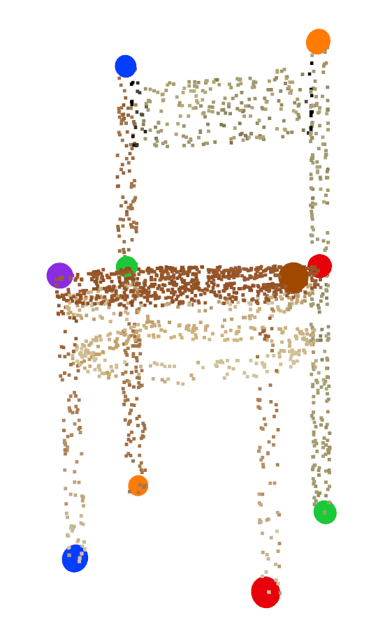
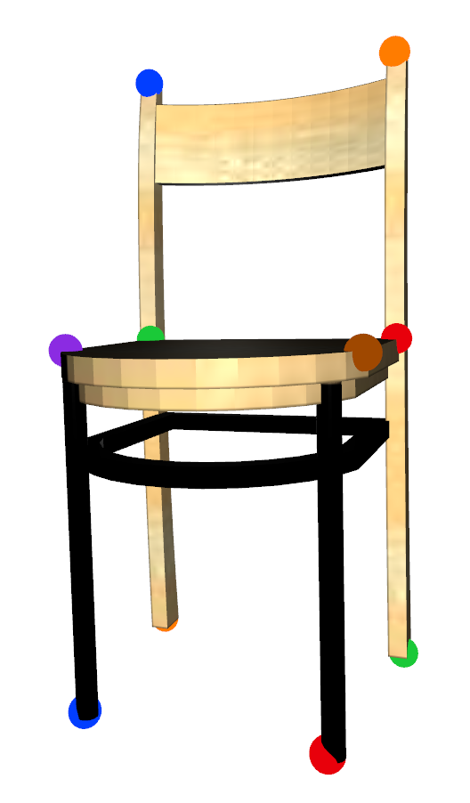
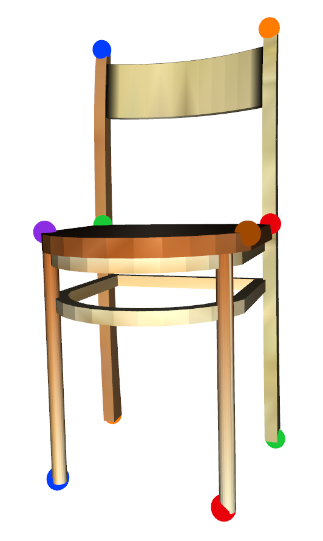

# KeypointNet

**Full dataset is available now!** KeypointNet is a large-scale and diverse 3D keypoint dataset that contains
83,231 keypoints and 8,329 3D models from 16 object categories, by leveraging numerous human annotations, based on ShapeNet models. Our paper is available on https://arxiv.org/pdf/2002.12687.pdf and is accepted to CVPR 2020.

# Change Logs
For updated dataset information, see [Change Log](CHANGELOG.md)

# Keypoint Data
Dataset can be downloaded from <a href="https://drive.google.com/drive/folders/1_d1TzZEF25Wy5kRj5ZugrgGeyf7xxu8F?usp=sharing" target="_blank">google drive</a> or <a href="http://youyangsoft.com/public/KeypointNet/ShapeNetCore.v2.zip" target="_blank">here</a>. Annotated JSON data is placed under **annotations**. In addition, we provide sampled point clouds (2048 points) for each ShapeNet model under **pcds**.

We have processed and cleaned labels for airplane (1022 models), bathtub (492 models), bed (146 models), bottle (380 models), cap (38 models), car (1002 models), chair (999 models), guitar (697 models), helmet (90 models), knife (270 models), laptop (439 models), motorcycle (298 models), mug (198 models), skateboard (141 models), table (1124 models) and vessel (910 models).

**UPDATE:** we have managed to add **color** information onto sampled point clouds and keypoints. In addition, since processing raw ShapeNet obj file as colored triangle meshes is painful, we have generated corresponding ply files (named **ShapeNetCore.v2.ply.zip**) with vertex colors (diffuse texture color), for those are interested in dealing with triangle meshes. We believe color is an important source when learning from 3D geometries.


<!-- {:height="360px" width="160px"}
{:height="360px" width="160px"}
{:height="360px" width="160px"} -->

## Data format
```javascript
[
    ...,
    {  
        "class_id": "03001627",  // WordNet id
        "model_id": "88382b877be91b2a572f8e1c1caad99e",  // model id
        "keypoints": [
            {
                "xyz": [0.16, 0.1, 0.1],  // xyz coordinate of keypoint
                "rgb": [255, 255, 255], // rgb color of keypoint, uint8
                "semantic_id": 0,  // id of semantic meaning
                "pcd_info": {
                    "point_index": 0  // keypoint index on corresponding point cloud
                },
                "mesh_info": {  // mesh information for both obj and ply files
                    "face_index": 0,  // index of mesh face where keypoint lies
                    "face_uv": [0.2, 0.4, 0.4]  // barycentric coordinate on corresponding mesh face
                }
            },
            ...
        ],
        "symmetries": { // information of keypoint symmetries
            "reflection": 
            [
                {
                    "kp_indexes": [0, 1]  // keypoint indexes of a reflection symmetric group
                },
                ...
            ],
            "rotation":
            [
                {
                    "kp_indexes": [0, 1, 2, 3],  // keypoint indexes of a rotation symmetric group
                    "is_circle": true,  // true if this rotation symmtric group is a rounding circle
                    "circle": {
                        "center": [0.2, 0.5, 0.2],  // circle center
                        "radius": 0.32,  // circle radius
                        "normal": [0, 1.0, 0],  // normal of circle plane
                    }
                },
                ...
            ]
        }

    },
    ...
]
```

# Examples
Example scripts on reading and visualizing keypoints on both point clouds and triangle meshes are placed under **examples**.

# Keypoint Detection Tasks
Keypoint saliency and correspondence training and evaluation baselines for various backbones are placed under **tasks**. For more details, please refer to **tasks/README.md**.

# Data Splits
train/val/test splits are placed under **splits**. Each line is formatted as `[class_id]-[model_id]`.


# Citation
If you use the KeypointNet data or code, please cite:
```
@article{you2020keypointnet,
  title={KeypointNet: A Large-scale 3D Keypoint Dataset Aggregated from Numerous Human Annotations},
  author={You, Yang and Lou, Yujing and Li, Chengkun and Cheng, Zhoujun and Li, Liangwei and Ma, Lizhuang and Lu, Cewu and Wang, Weiming},
  journal={arXiv preprint arXiv:2002.12687},
  year={2020}
}
```

# TODOs

- [x] clean labels for more classes
- [x] add colored pcds/meshes
- [ ] a browser interface to explore dataset
