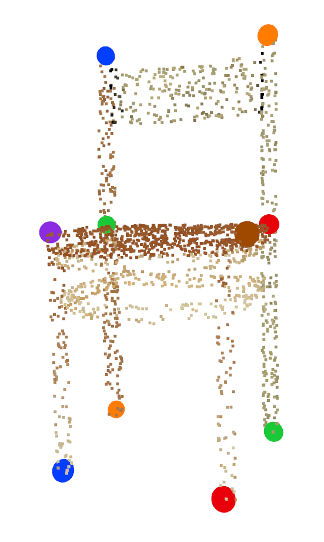
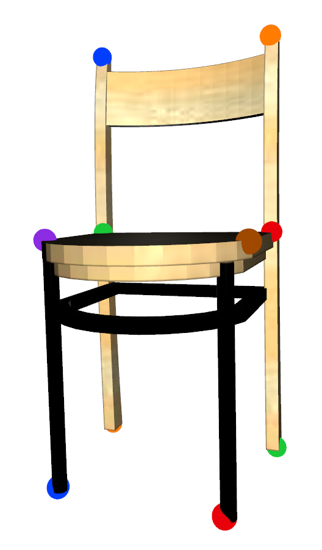
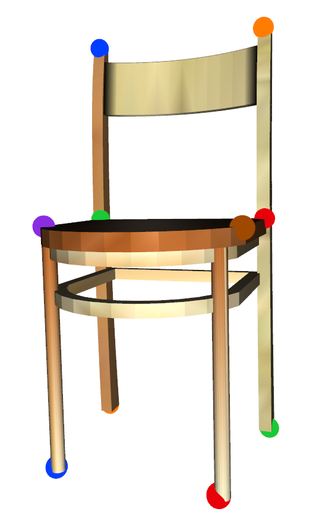

# KeypointNet: A Large-Scale 3D Keypoint Dataset (CVPR 2020)

KeypointNet is a large-scale and diverse 3D keypoint dataset that contains **83,231 keypoints** and **8,329 3D models** from **16 object categories**, aggregated from numerous human annotations on ShapeNet models.

[Paper (arXiv)](https://arxiv.org/pdf/2002.12687.pdf) | [Dataset Explorer](http://qq456cvb.github.io/keypointnet/explore/) — browse the annotated keypoints interactively in your browser.



## Download

The full dataset is available on [Google Drive](https://drive.google.com/drive/folders/1_d1TzZEF25Wy5kRj5ZugrgGeyf7xxu8F?usp=sharing) or [OneDrive](https://1drv.ms/u/s!Aj0NuSsDz6hDyF3LT3xaPkXK9DXC?e=kcrfSg). It contains:

- **`annotations/`** — keypoint annotations as one JSON file per category (format below).
- **`pcds/`** — sampled colored point clouds (2,048 points) for each ShapeNet model.
- **`ShapeNetCore.v2.ply.zip`** — colored triangle meshes (`.ply` with diffuse-texture vertex colors). Processing raw ShapeNet `.obj` files as colored meshes is painful, so we provide these ready to use; color is a valuable signal when learning from 3D geometry.
- **`knife_misaligned.txt`** — a list of knives that are misaligned (x-axis flipped) in the original ShapeNet.

Labels are processed and cleaned for: airplane (1022 models), bathtub (492), bed (146), bottle (380), cap (38), car (1002), chair (999), guitar (697), helmet (90), knife (270), laptop (439), motorcycle (298), mug (198), skateboard (141), table (1124) and vessel (910).

This repository ships one chair (`pcds/`, `models/`, `annotations/chair.json`) as a self-contained sample so the example script runs out of the box.

## Data Format

Each category JSON is a list of annotated models:

```javascript
[
    {
        "class_id": "03001627",  // WordNet id
        "model_id": "88382b877be91b2a572f8e1c1caad99e",
        "keypoints": [
            {
                "xyz": [0.16, 0.1, 0.1],   // keypoint coordinate
                "rgb": [255, 255, 255],    // keypoint color, uint8
                "semantic_id": 0,          // id of semantic meaning (consistent within a category)
                "pcd_info": {
                    "point_index": 0       // keypoint index on the corresponding point cloud
                },
                "mesh_info": {             // for both obj and ply meshes
                    "face_index": 0,       // index of the mesh face containing the keypoint
                    "face_uv": [0.2, 0.4, 0.4]  // barycentric coordinate on that face
                }
            },
            ...
        ],
        "symmetries": {
            "reflection": [
                { "kp_indexes": [0, 1] }   // a reflection-symmetric keypoint group
            ],
            "rotation": [
                {
                    "kp_indexes": [0, 1, 2, 3],  // a rotation-symmetric keypoint group
                    "is_circle": true,           // whether the group forms a circle
                    "circle": {
                        "center": [0.2, 0.5, 0.2],
                        "radius": 0.32,
                        "normal": [0, 1.0, 0]
                    }
                }
            ]
        }
    },
    ...
]
```

## Visualizing Keypoints

`examples/visualize.py` renders keypoints on the point cloud, the textured `.obj` mesh, and the colored `.ply` mesh using Open3D:

```bash
pip install open3d seaborn numpy
python examples/visualize.py
```

Keypoints are placed via `pcd_info.point_index` on point clouds and via barycentric interpolation (`mesh_info.face_index` + `face_uv`) on meshes, with one color per `semantic_id`.

## Benchmarks: Keypoint Saliency and Correspondence

Training and evaluation baselines for **keypoint saliency** and **keypoint correspondence** with eight point-cloud backbones (PointNet, PointNet++, DGCNN, RS-CNN, RSNet, SpiderCNN, GraphCNN, PointConv) live under [`benchmark_scripts/`](benchmark_scripts):

```bash
cd benchmark_scripts

# train, e.g. saliency estimation with PointNet
python train.py task=saliency network=pointnet

# test, e.g. correspondence with RS-CNN
python test.py task=correspondence network=rscnn
```

Notes:

- For PointNet++ and RS-CNN, build the custom CUDA ops first: `python setup.py install` under `models/pointnet2_utils/custom_ops` or `models/rscnn_utils/custom_ops`.
- `setup_env.sh` / `env.yml` set up the PyTorch environment.
- See [`benchmark_scripts/README.md`](benchmark_scripts/README.md) for details.

## Data Splits

Train/val/test splits are under **`splits/`**; each line is formatted as `[class_id]-[model_id]`.

## Change Log

See [CHANGELOG.md](CHANGELOG.md) for dataset updates (label fixes, semantic-id changes, colored data additions).

## Related Projects

- [UKPGAN](https://github.com/qq456cvb/UKPGAN) — unsupervised keypoint detector, unordered but SE(3)-invariant (CVPR 2022).
- [SkeletonMerger](https://github.com/eliphatfs/SkeletonMerger) — unsupervised keypoint detector, ordered but not SE(3)-invariant.

## Citation

If you find KeypointNet data or code useful in your research, please consider citing:

```bibtex
@article{you2020keypointnet,
  title={KeypointNet: A Large-scale 3D Keypoint Dataset Aggregated from Numerous Human Annotations},
  author={You, Yang and Lou, Yujing and Li, Chengkun and Cheng, Zhoujun and Li, Liangwei and Ma, Lizhuang and Lu, Cewu and Wang, Weiming},
  journal={arXiv preprint arXiv:2002.12687},
  year={2020}
}
```

## License

KeypointNet is released under the MIT license — see [LICENSE.md](LICENSE.md).
